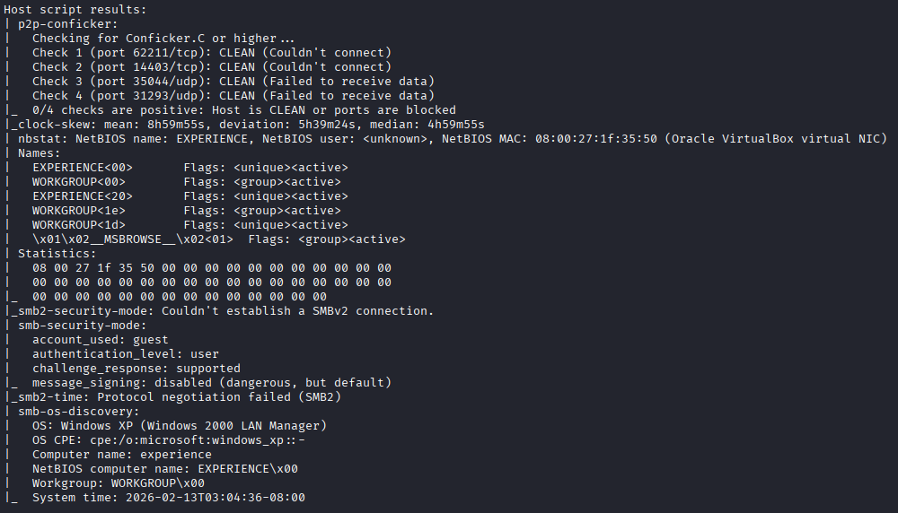
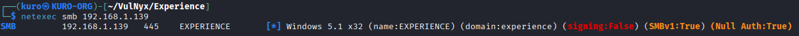
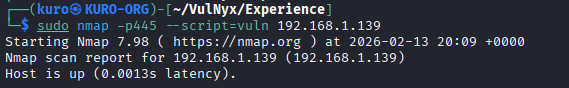
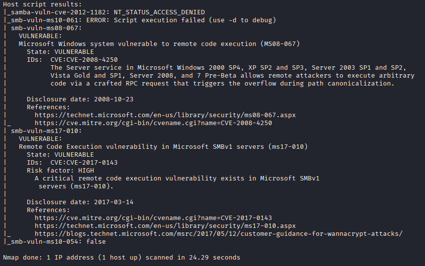
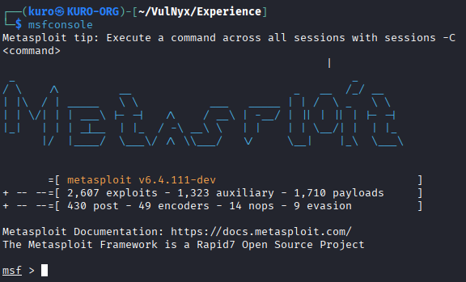
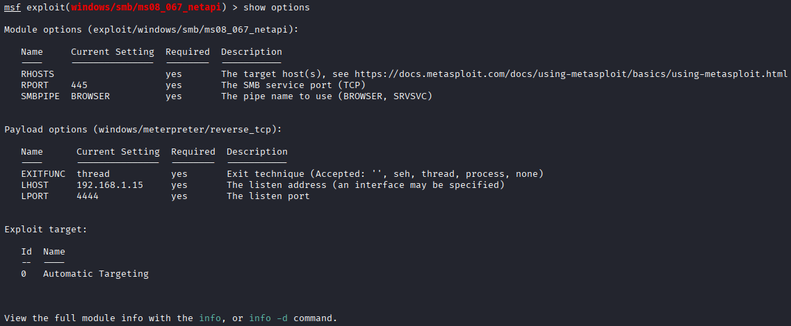

# 🛡️ Experience — VulNyx

---

## ℹ️ Information

The Experience machine exposes SMB services running on an unpatched Windows XP system. This configuration is vulnerable to MS08-067 (CVE-2008-4250), a critical remote code execution flaw in the Windows Server service (NetAPI).

By sending a specially crafted RPC request over SMB port, an unauthenticated attacker can trigger a buffer overflow and execute arbitrary code with SYSTEM-level privileges. Successful exploitation results in full compromise of the target system, impacting confidentiality, integrity, and availability.

| Category | Details |
|:--------:|:------:|
| Name | Experience |
| Platform | VulNyx |
| Difficulty | Easy |
| Operating System | Windows XP |
| Initial Attack Vector | MS08-067 (CVE-2008-4250) |
| Final Outcome | System Compromise |

---

## 📚 Scope & Methodology

The assessment was conducted following a structured approach, dividing the process into the following phases:

1. Controlled active reconnaissance  
2. Targeted enumeration of identified services  
3. Validation of known vulnerabilities  
4. Minimization of unnecessary noise during testing

---

## 🔍 Reconnaissance

As an initial step, a local network discovery scan was performed using `arp-scan` to identify active hosts within the same subnet.

This command sends ARP requests across the local network segment in order to detect live hosts responding at Layer 2. Unlike traditional ICMP-based discovery, ARP scanning is more reliable within local networks because it does not depend on firewall rules blocking ICMP traffic.

The scan identified an active host at:

- 192.168.1.139

- MAC Address: 08:00:27:1f:35:50

The MAC address prefix 08:00:27 is commonly associated with VirtualBox virtual machines. In this case, this aligns with the lab setup, as the vulnerable environment is intentionally virtualized for proof-of-concept (PoC) testing.

  

An ICMP echo request was sent to confirm host availability and network reachability.
The response confirmed that the target was alive, with a TTL value of 128, suggesting a Windows-based operating system.

This confirmed the presence of the target machine within the local network and provided the IP address required for further enumeration.

---

## 🔎 Enumeration

After confirming that the target host was alive and reachable, a port scan was conducted using `Nmap` in order to identify exposed services and potential attack vectors.

The scan included default NSE scripts to gather additional service information and perform basic vulnerability checks.

  

The results revealed ports 135 (MSRPC), 139 (NetBIOS), and 445 (SMB) open, indicating a Windows-based host exposing file-sharing services.

Service fingerprinting pointed to Windows XP as the underlying operating system. The SMB configuration showed message signing disabled and failed SMBv2 negotiation, both consistent with an outdated and potentially vulnerable setup.

Although `Nmap` provided strong indicators about the operating system and SMB configuration, additional SMB enumeration was performed using netexec to validate these findings.

  

The results from `netexec` confirmed the system was running Windows 5.1 x32 (Windows XP), with SMBv1 enabled and SMB signing disabled. These findings align with the initial `Nmap` enumeration and provide a reliable understanding of the target’s SMB configuration.

---

## 🔬 Vulnerability Assessment

With the operating system and SMB configuration verified, vulnerability-specific NSE scripts will be used to evaluate known vulnerabilities affecting the SMB service.

  

The scan results indicate that the target is vulnerable to both MS08-067 (CVE-2008-4250) and MS17-010 (CVE-2017-0143), two critical remote code execution vulnerabilities affecting the SMB service.

  

MS08-067 impacts the Windows Server service (NetAPI), allowing unauthenticated attackers to execute arbitrary code via a specially crafted RPC request.

MS17-010 targets the SMBv1 protocol and was widely exploited in large-scale attacks such as WannaCry.

---

## 💥 Exploitation

In order to exploit the confirmed vulnerabilities in the Windows XP environment, MS08-067 was selected as the primary attack vector.

The Metasploit Framework will be used due to its extensive collection of preloaded modules and its flexibility for configuring target-specific parameters. The process will begin by locating the appropriate module, setting the necessary options, and then executing the exploit in a controlled and systematic manner to ensure precise results.

  

The initial step in the exploitation process is to locate and prepare the MS08-067 module within the Metasploit Framework for configuration and execution.

  

After locating the module, the configuration phase begins. For this proof of concept, only the RHOSTS parameter needs to be set in order to define the target IP address, while the remaining options are left with their default values.

  

