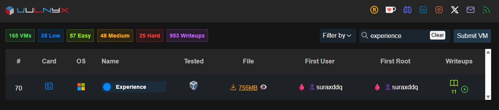
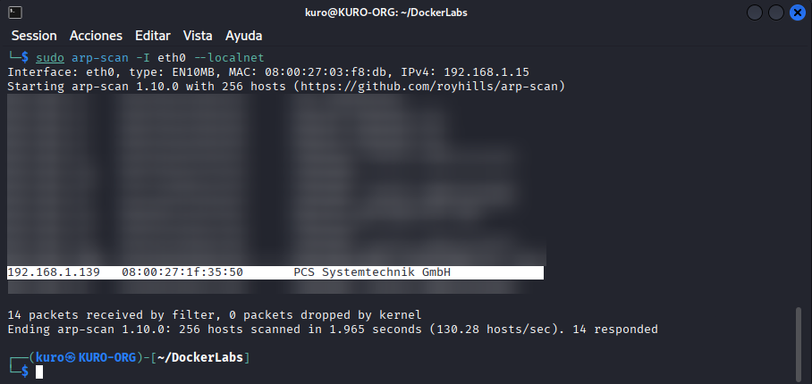
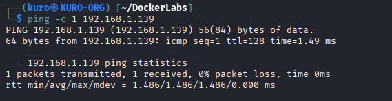
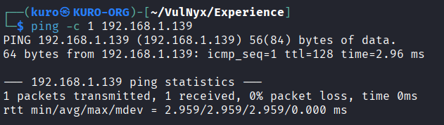

# 🛡️ Experience — VulNyx

---

## ℹ️ Information

The Experience machine exposes SMB services running on an unpatched Windows XP system. This configuration is vulnerable to MS08-067 (CVE-2008-4250), a critical remote code execution flaw in the Windows Server service (NetAPI).

By sending a specially crafted RPC request over SMB port, an unauthenticated attacker can trigger a buffer overflow and execute arbitrary code with SYSTEM-level privileges. Successful exploitation results in full compromise of the target system, impacting confidentiality, integrity, and availability.

| Category | Details |
|:--------:|:------:|
| Name | Experience |
| Platform | VulNyx |
| Difficulty | Easy |
| Operating System | Windows XP |
| Initial Attack Vector | MS08-067 (CVE-2008-4250) |
| Final Outcome | System Compromise |

---

## 📚 Scope & Methodology

The assessment was conducted following a structured approach, dividing the process into the following phases:

1. Controlled active reconnaissance  
2. Targeted enumeration of identified services  
3. Validation of known vulnerabilities  
4. Minimization of unnecessary noise during testing

---

## 🔍 Reconnaissance

As an initial step, a local network discovery scan was performed using `arp-scan` to identify active hosts within the same subnet.

This command sends ARP requests across the local network segment in order to detect live hosts responding at Layer 2. Unlike traditional ICMP-based discovery, ARP scanning is more reliable within local networks because it does not depend on firewall rules blocking ICMP traffic.

The scan identified an active host at:

- 192.168.1.139

- MAC Address: 08:00:27:1f:35:50

The MAC address prefix 08:00:27 is commonly associated with VirtualBox virtual machines, suggesting that the target system is running in a virtualized environment.

  

An ICMP echo request was sent to confirm host availability and network reachability.
The response confirmed that the target was alive, with a TTL value of 128, suggesting a Windows-based operating system.

This confirmed the presence of the target machine within the local network and provided the IP address required for further enumeration.

## 🔎 Enumeration

